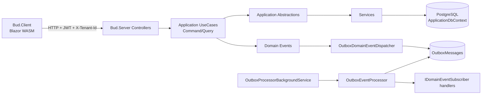
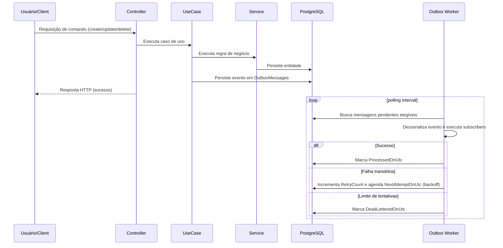
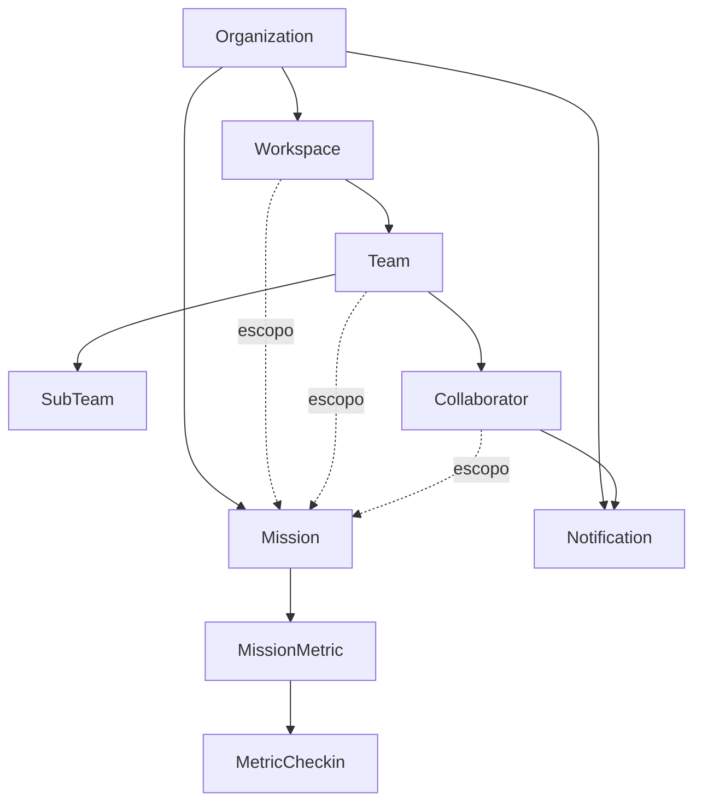
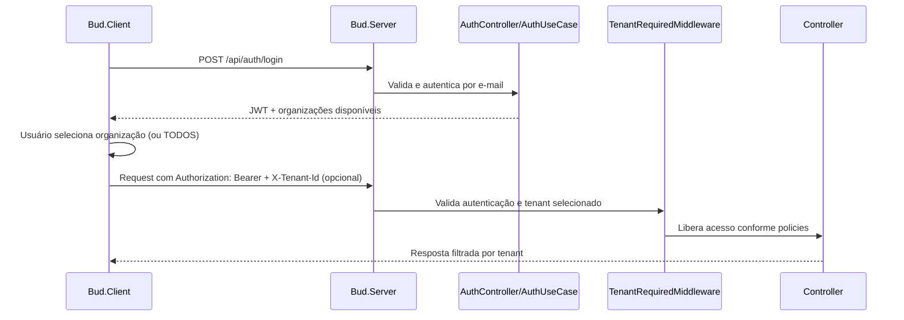
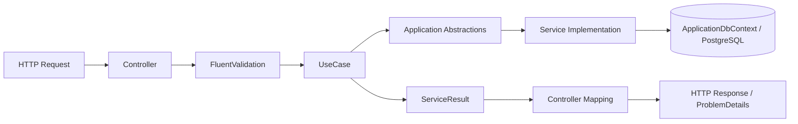
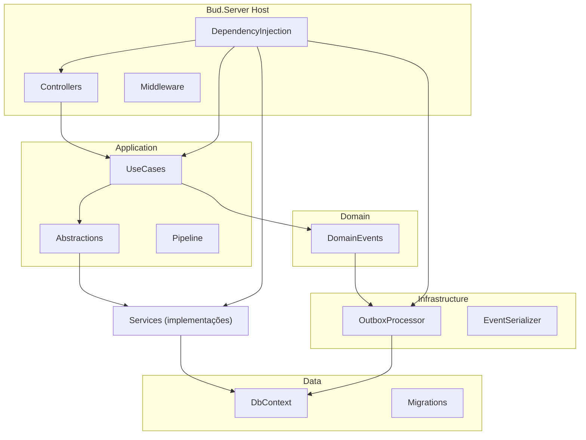
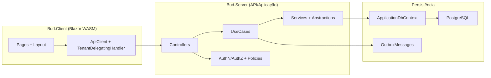

# Bud

Aplicação unificada em ASP.NET Core + Blazor WebAssembly (SPA),
utilizando PostgreSQL.

## Para quem é este README

Este documento é voltado para devs que precisam:
- entender rapidamente a arquitetura e os padrões do Bud,
- subir o ambiente local,
- executar fluxos principais de desenvolvimento com segurança.

## Índice

- [Arquitetura da aplicação](#arquitetura-da-aplicação)
- [Padrões arquiteturais adotados](#padrões-arquiteturais-adotados)
- [Como contribuir](#como-contribuir)
- [Como rodar](#como-rodar-com-docker)
- [Como rodar sem Docker](#como-rodar-sem-docker)
- [Servidor MCP (Missões e Métricas)](#servidor-mcp-missões-e-métricas)
- [Deploy no Google Cloud](#deploy-no-google-cloud)
- [Onboarding rápido (30 min)](#onboarding-rápido-30-min)
- [Testes](#testes)
- [Outbox (resiliência de eventos)](#outbox-resiliência-de-eventos)
- [Health checks](#health-checks)
- [Endpoints principais](#endpoints-principais)
- [Sistema de Design e Tokens](#sistema-de-design-e-tokens)

## Arquitetura da aplicação

### Visão geral

O Bud segue uma arquitetura em camadas com separação explícita de responsabilidades:

- **API/Host (`Bud.Server`)**: exposição HTTP, autenticação/autorização, middleware e composição de dependências.
- **Application**: casos de uso (`Command/Query`), contratos de entrada/saída e regras de orquestração.
- **Domain**: eventos e conceitos de domínio.
- **Infrastructure**: implementação de capacidades técnicas (Outbox, processamento em background, serialização de eventos).
- **Data**: EF Core (`ApplicationDbContext`), mapeamentos e migrations.
- **Client (`Bud.Client`)**: SPA Blazor WASM com consumo da API.
- **Shared (`Bud.Shared`)**: contratos e modelos compartilhados entre cliente e servidor.

### Organização do backend (Bud.Server)

- **Controllers** recebem requests, validam payloads (FluentValidation) e delegam para UseCases.
- **UseCases** centralizam o fluxo da aplicação e retornam `ServiceResult`/`ServiceResult<T>`.
- **Abstractions (`Application/Abstractions`)** definem portas usadas pelos UseCases.
- **Services** implementam essas portas com regras de negócio e acesso a dados.
- **DependencyInjection** modulariza bootstrap (`BudApi`, `BudSecurity`, `BudData`, `BudApplication`).

### Padrões arquiteturais adotados

- **UseCases + Ports/Adapters**  
  Controllers delegam para UseCases, que dependem de abstrações; serviços implementam essas portas.
  Referências: `docs/adr/ADR-0002-usecases-abstractions-services.md`.
- **Policy-based Authorization (Requirement/Handler)**  
  Regras de autorização centralizadas em policies e handlers, reduzindo condicionais espalhadas.
  Referências: `docs/adr/ADR-0004-autenticacao-autorizacao.md`.
- **Specification Pattern (consultas reutilizáveis)**  
  Filtros de domínio encapsulados em specifications para evitar duplicação de predicados.
  Referências: `src/Bud.Server/Domain/Common/Specifications/`.
- **Domain Events + Subscribers**  
  Eventos de domínio desacoplam efeitos colaterais e permitem evolução incremental de fluxos.
  Referências: `src/Bud.Server/Domain/*/Events` e `src/Bud.Server/Application/*/Events`.
- **UseCase Pipeline (cross-cutting concerns)**  
  Comportamentos transversais (ex.: logging) aplicados via pipeline, sem poluir cada caso de uso.
  Referências: `src/Bud.Server/Application/Common/Pipeline/`.
- **Structured Logging (source-generated)**  
  Logs com `[LoggerMessage]` definidos localmente por componente (`partial`), com `EventId` estável e sem catálogo central global.
  Referências: `src/Bud.Server/Infrastructure/Events/OutboxEventProcessor.cs`, `src/Bud.Server/Infrastructure/Events/OutboxProcessorBackgroundService.cs`, `src/Bud.Server/Application/Common/Pipeline/LoggingUseCaseBehavior.cs`.
- **Outbox Pattern (confiabilidade assíncrona)**  
  Garante processamento assíncrono durável com retry/backoff/dead-letter.
  Referências: `docs/adr/ADR-0008-outbox-retry-deadletter.md` e seção **Outbox (resiliência de eventos)** abaixo.
- **Governança arquitetural por testes + ADRs**  
  Decisões versionadas (ADR) e proteção contra regressão de fronteiras via testes de arquitetura.
  Referências: `docs/adr/README.md` e `tests/Bud.Server.Tests/Architecture/ArchitectureTests.cs`.

### Multi-tenancy

Isolamento por organização (`OrganizationId`) com:

- `ITenantProvider` para resolver tenant do contexto autenticado.
- Query filters globais do EF Core.
- `TenantRequiredMiddleware` para reforçar seleção/autorização de tenant em `/api/*`.
- Cabeçalho `X-Tenant-Id` enviado pelo client quando uma organização específica está selecionada.

### Fluxo de requisição (resumo)

1. Request chega no controller.
2. Payload é validado.
3. Controller chama o UseCase correspondente.
4. UseCase aplica regras de autorização/orquestração e delega para portas/serviços.
5. Serviço persiste/consulta via `ApplicationDbContext`.
6. Resultado (`ServiceResult`) é mapeado para resposta HTTP.

### Outbox e processamento assíncrono

Visão geral no fluxo arquitetural. Para detalhes operacionais (endpoints e configuração),
veja a seção **Outbox (resiliência de eventos)** abaixo.

### Testes e governança arquitetural

- **Unit tests**: regras de negócio, validações, use cases e componentes de infraestrutura.
- **Integration tests**: ciclo HTTP completo com PostgreSQL em container.
- **Architecture tests**: evitam regressão de fronteira entre camadas (ex.: controller depender de service legado).
- **ADRs**: decisões arquiteturais versionadas em `docs/adr/`.

### ADRs e fluxo de PR

- Toda mudança arquitetural deve criar/atualizar ADR.
- ADRs seguem convenção `docs/adr/ADR-XXXX-*.md`.
- Índice e convenções: `docs/adr/README.md`.
- No PR, inclua explicitamente:
  - `Architectural impact: yes/no`
  - `ADR: ADR-XXXX` (quando aplicável)

Para lista atualizada de ADRs e ordem recomendada de leitura, consulte:
`docs/adr/README.md`.

### Diagramas

#### Arquitetura e fluxo principal



#### Sequência de processamento do Outbox



#### Modelo de domínio e hierarquia organizacional



#### Fluxo de autenticação, tenant e autorização



#### Pipeline de requisição (Controller -> UseCase -> Service)



#### Módulos do backend e dependências



#### Fronteira de responsabilidades (Client x API x Dados)



## Como contribuir

Fluxo recomendado de contribuição para manter qualidade arquitetural e consistência:

1. Crie uma branch curta e focada no objetivo da mudança.
2. Escreva/atualize testes antes da implementação (TDD: Red -> Green -> Refactor).
3. Implemente seguindo os padrões do projeto:
   - Controllers -> UseCases -> Abstractions -> Services
   - autorização por policies/handlers
   - mensagens de erro/validação em pt-BR
4. Atualize documentação OpenAPI (summary/description/status/errors) quando alterar contratos.
5. Se houver mudança arquitetural, atualize/crie ADR em `docs/adr/`.
6. Rode a suíte de testes aplicável e valide Swagger/health checks.
7. Abra PR com impacto arquitetural explícito e referência de ADR (quando aplicável).

## Como rodar com Docker

```bash
docker compose up --build
```

- App (UI + API): `http://localhost:8080`
- Swagger (ambiente Development): `http://localhost:8080/swagger`

### Padrão de desenvolvimento (sem hot reload)

- O hot reload do Blazor WASM está desativado por padrão.
- O build usa caches de NuGet e de compilação via volumes nomeados para acelerar o ciclo local.

Se você encontrar assets antigos no browser, limpe os volumes e recompile:

```bash
docker compose down -v
docker compose up --build
```

## Como rodar sem Docker

Pré-requisitos:

- .NET SDK 10
- PostgreSQL 16+

Comandos:

```bash
dotnet restore
dotnet build
dotnet run --project src/Bud.Server
```

## Servidor MCP (Missões e Métricas)

O repositório inclui um servidor MCP HTTP em `src/Bud.Mcp`, que consome a API do `Bud.Server`.

No ambiente local via Docker Compose:
- API + frontend: `http://localhost:8080`
- MCP: `http://localhost:8081`

### Configuração (`appsettings` + override por ambiente)

O `Bud.Mcp` lê configuração na seguinte ordem:
1. `appsettings.json`
2. `appsettings.{DOTNET_ENVIRONMENT}.json`
3. variáveis de ambiente (override)

Chaves suportadas:
- `BudMcp:ApiBaseUrl` (ou `BUD_API_BASE_URL`)
- `BudMcp:UserEmail` (ou `BUD_USER_EMAIL`) opcional, para login automático no boot
- `BudMcp:DefaultTenantId` (ou `BUD_DEFAULT_TENANT_ID`)
- `BudMcp:HttpTimeoutSeconds` (ou `BUD_HTTP_TIMEOUT_SECONDS`)
- `BudMcp:SessionIdleTtlMinutes` (ou `BUD_SESSION_IDLE_TTL_MINUTES`)

### Subindo via Docker Compose

```bash
docker compose up --build
```

O serviço `mcp` é criado no compose usando:
- `Dockerfile` (target `dev-mcp-web`)
- `DOTNET_ENVIRONMENT=Development` (usa `src/Bud.Mcp/appsettings.Development.json`)
- `BUD_API_BASE_URL=http://web:8080` para chamadas internas ao `Bud.Server`
- mapeamento de porta `8081:8080` para evitar conflito com o `web`

Health checks do MCP local:

```bash
curl -i http://localhost:8081/health/live
curl -i http://localhost:8081/health/ready
```

Exemplo de `initialize` no endpoint MCP:

```bash
curl -s http://localhost:8081/ \
  -H "Content-Type: application/json" \
  -d '{"jsonrpc":"2.0","id":1,"method":"initialize"}'
```

A resposta inclui o header `X-Mcp-Session-Id`, que deve ser enviado nas chamadas seguintes (`tools/list`, `tools/call`, etc.).

Fluxo obrigatório para atualizar catálogo MCP:

```bash
dotnet run --project src/Bud.Mcp/Bud.Mcp.csproj -- generate-tool-catalog
dotnet run --project src/Bud.Mcp/Bud.Mcp.csproj -- check-tool-catalog --fail-on-diff
```

Regras importantes do catálogo:
- As ferramentas de domínio (`mission_*`, `mission_metric_*`, `metric_checkin_*`) são carregadas exclusivamente do arquivo `src/Bud.Mcp/Tools/Generated/mcp-tool-catalog.json`.
- O `Bud.Mcp` falha na inicialização se o catálogo estiver ausente, inválido, vazio ou sem ferramentas de domínio obrigatórias.
- O comando `check-tool-catalog --fail-on-diff` também valida o contrato mínimo de campos `required` por ferramenta e retorna erro quando houver quebra de contrato.

Se estiver rodando local com `DOTNET_ENVIRONMENT=Development`, defina:
`BUD_API_BASE_URL=http://localhost:8080`.

### Ferramentas MCP disponíveis

- `auth_login`
- `auth_whoami`
- `tenant_list_available`
- `tenant_set_current`
- `session_bootstrap`
- `help_action_schema`
- `mission_create`, `mission_get`, `mission_list`, `mission_update`, `mission_delete`
- `mission_metric_create`, `mission_metric_get`, `mission_metric_list`, `mission_metric_update`, `mission_metric_delete`
- `metric_checkin_create`, `metric_checkin_get`, `metric_checkin_list`, `metric_checkin_update`, `metric_checkin_delete`

### Descoberta de parâmetros e bootstrap de sessão no MCP

- `auth_login` retorna `whoami`, `requiresTenantForDomainTools` e `nextSteps` para orientar o agente nos próximos passos.
- `session_bootstrap` retorna snapshot de sessão (`whoami`, `availableTenants`, tenant atual) e `starterSchemas` para fluxos de criação.
- `help_action_schema` retorna `required`, `inputSchema` e `example` para uma ação específica (ou todas as ações, quando `action` não é informado).
- Em erro de validação da API, o MCP retorna `statusCode`, `title`, `detail` e `errors` por campo quando disponível.

## Deploy no Google Cloud

Scripts disponíveis:

- `scripts/gcp-bootstrap.sh`: prepara infraestrutura base (Artifact Registry, Cloud SQL, service account, secrets).
- `scripts/gcp-deploy-web.sh`: deploy do `Bud.Server` (inclui migration).
- `scripts/gcp-deploy-mcp.sh`: deploy do `Bud.Mcp` HTTP.
- `scripts/gcp-deploy-all.sh`: executa deploy completo (`Bud.Server` + `Bud.Mcp`).

Fluxo recomendado:

```bash
export PROJECT_ID="seu-projeto"
export REGION="us-central1"
export DB_PASS="senha-forte"
export JWT_KEY="chave-jwt-com-32-ou-mais-caracteres"

./scripts/gcp-bootstrap.sh
./scripts/gcp-deploy-all.sh
```

Fluxo manual por etapa:

```bash
./scripts/gcp-deploy-web.sh
./scripts/gcp-deploy-mcp.sh
```

Para detalhes operacionais e troubleshooting de deploy, consulte `DEPLOY.md`.

## Onboarding rápido (30 min)

Objetivo: validar ponta a ponta (auth, tenant, CRUD básico e leitura) em ambiente local.

### 1) Subir a aplicação

Opção A (recomendada):

```bash
docker compose up --build
```

Opção B (sem Docker):

```bash
dotnet restore
dotnet build
dotnet run --project src/Bud.Server
```

### 2) Login e captura do token

```bash
curl -s -X POST http://localhost:8080/api/auth/login \
  -H "Content-Type: application/json" \
  -d '{"email":"admin@getbud.co"}'
```

Copie o `token` da resposta e exporte:

```bash
export BUD_TOKEN="<jwt>"
```

### 3) Descobrir organizações disponíveis

```bash
curl -s http://localhost:8080/api/auth/my-organizations \
  -H "Authorization: Bearer $BUD_TOKEN"
```

Copie um `id` e exporte:

```bash
export BUD_ORG_ID="<organization-id>"
```

### 4) Smoke test de leitura tenant-scoped

```bash
curl -s "http://localhost:8080/api/missions?page=1&pageSize=10" \
  -H "Authorization: Bearer $BUD_TOKEN" \
  -H "X-Tenant-Id: $BUD_ORG_ID"
```

### 5) Smoke test de criação de missão

```bash
curl -s -X POST http://localhost:8080/api/missions \
  -H "Authorization: Bearer $BUD_TOKEN" \
  -H "X-Tenant-Id: $BUD_ORG_ID" \
  -H "Content-Type: application/json" \
  -d '{
    "name":"Onboarding - Missão",
    "description":"Validação ponta a ponta",
    "startDate":"2026-01-01T00:00:00Z",
    "endDate":"2026-12-31T23:59:59Z",
    "status":"Planned",
    "scopeType":"Organization",
    "scopeId":"'"$BUD_ORG_ID"'"
  }'
```

### 6) Debug rápido no backend

- Acesse `http://localhost:8080/swagger` para executar os mesmos fluxos pela UI.
- Consulte `GET /health/ready` para validar PostgreSQL + Outbox.
- Em caso de erro 403, valide se o header `X-Tenant-Id` foi enviado (exceto cenário global admin em "TODOS").

### 7) Troubleshooting rápido (dev local)

- **Porta 8080 ocupada**  
  Sintoma: erro ao subir `docker compose up --build` com bind em `8080`.  
  Ação: pare o processo/serviço que está usando a porta ou altere o mapeamento no `docker-compose.yml`.

- **Falha de conexão com PostgreSQL**  
  Sintoma: `/health/ready` retorna unhealthy para banco.  
  Ação: confirme se o container `db` subiu e se a connection string está correta (`ConnectionStrings:DefaultConnection`).

- **401/403 em endpoints protegidos**  
  Sintoma: chamadas autenticadas falham mesmo após login.  
  Ação: verifique `Authorization: Bearer <token>` e, para endpoints tenant-scoped, envie `X-Tenant-Id`.

- **Dados/artefatos antigos no browser**  
  Sintoma: UI não reflete mudanças recentes.  
  Ação: execute `docker compose down -v && docker compose up --build` e force reload no navegador.

## Testes

```bash
# suíte completa
dotnet test

# testes MCP
dotnet test tests/Bud.Mcp.Tests

# apenas unitários
dotnet test tests/Bud.Server.Tests

# apenas integração
dotnet test tests/Bud.Server.IntegrationTests
```

Observação:

- `dotnet test` usa `Bud.slnx` e executa também `tests/Bud.Mcp.Tests`.
- Testes de integração usam PostgreSQL via Testcontainers.
- Use `dotnet test --nologo` para saída mais limpa no terminal.
- A solução usa `TreatWarningsAsErrors=true`; avisos quebram build/test.

## Documentação da API (OpenAPI/Swagger)

- UI interativa (Development): `http://localhost:8080/swagger`
- Documento OpenAPI bruto: `http://localhost:8080/openapi/v1.json`
- A documentação é enriquecida com:
  - `ProducesResponseType` por endpoint
  - comentários XML (`summary`, `response`, `remarks`)
  - metadados de conteúdo (`Consumes`/`Produces`) quando aplicável
- Para campos enum em payload JSON, a API aceita tanto `string` (case-insensitive) quanto `number` (compatibilidade retroativa).

## Sistema de Design e Tokens

O Bud 2.0 usa um sistema de tokens de design baseado no [Figma Style Guide](https://www.figma.com/design/j3n8YHBusCH8KEHvheGeF8/-ASSETS--Style-Guide).

### Cores de marca

- **Primária**: Orange (#FF6B35) - CTAs, estados ativos e ações principais
- **Secundária**: Wine (#E838A3) - acentos, destaques e ações secundárias

### Tipografia

- **Crimson Pro**: fonte serifada para títulos e destaques
- **Plus Jakarta Sans**: fonte sem serifa para texto e componentes de interface

### Tokens de design

Todos os valores de design (cores, tipografia, espaçamento e sombras) são definidos como propriedades CSS em [`src/Bud.Client/wwwroot/css/tokens.css`](src/Bud.Client/wwwroot/css/tokens.css).

**Exemplo de uso:**
```css
.button {
    background: var(--color-brand-primary);
    padding: var(--spacing-3) var(--spacing-4);
    border-radius: var(--radius-md);
    font-size: var(--font-size-base);
}
```

### Atualização de tokens

Veja [DESIGN_TOKENS.md](DESIGN_TOKENS.md) para:
- Referência completa de tokens
- Processo de atualização a partir do Figma
- Convenções de nomenclatura
- Boas práticas

## Migrations (EF Core)

Já existe a migration inicial (`InitialCreate`). Para aplicar no banco com Docker rodando:

```bash
docker run --rm -v "$(pwd)/src":/src -w /src/Bud.Server --network bud_default \
  -e ConnectionStrings__DefaultConnection="Host=db;Port=5432;Database=bud;Username=postgres;Password=postgres" \
  mcr.microsoft.com/dotnet/sdk:10.0 \
  bash -lc "dotnet tool install --tool-path /tmp/tools dotnet-ef --version 10.0.2 && /tmp/tools/dotnet-ef database update"
```

No ambiente Development, a API tenta aplicar migrations automaticamente no startup.

## Outbox (resiliência de eventos)

O projeto usa Outbox para garantir processamento assíncrono confiável de eventos de domínio.

- Persistência transacional de eventos em `OutboxMessages`
- Worker em background para processamento
- Retry com backoff exponencial
- Dead-letter após esgotar tentativas
- Endpoints administrativos para consulta e reprocessamento

### Observabilidade e logging do Outbox

- Logging estruturado no ciclo completo: início, sucesso, retry e dead-letter.
- `EventId` estável por tipo de evento de operação para facilitar monitoramento e alertas.
- Campos-chave registrados: `OutboxMessageId`, `EventType`, `Attempt/RetryCount`, `NextAttemptOnUtc`, `ElapsedMs`, `Error`.

### Endpoints de Outbox (admin)

- `GET /api/outbox/dead-letters?page=1&pageSize=10`
- `POST /api/outbox/dead-letters/{id}/reprocess`
- `POST /api/outbox/dead-letters/reprocess`

### Configuração (`appsettings`)

Tudo fica sob a chave `Outbox`:

```json
"Outbox": {
  "HealthCheck": {
    "MaxDeadLetters": 0,
    "MaxOldestPendingAge": "00:15:00"
  },
  "Processing": {
    "MaxRetries": 5,
    "BaseRetryDelay": "00:00:05",
    "MaxRetryDelay": "00:05:00",
    "BatchSize": 100,
    "PollingInterval": "00:00:05"
  }
}
```

O endpoint `/health/ready` considera banco e saúde do Outbox.

## Health checks

- `GET /health/live`: liveness (sempre saudável).
- `GET /health/ready`: readiness (PostgreSQL + Outbox).

## Endpoints principais

### Uso diário

- `POST /api/auth/login`
- `POST /api/auth/logout`
- `GET /api/auth/my-organizations`
- `POST /api/organizations`
- `POST /api/workspaces`
- `POST /api/teams`
- `POST /api/collaborators`
- `POST /api/missions`
- `GET /api/missions`
- `GET /api/missions/progress`
- `POST /api/mission-metrics`
- `GET /api/mission-metrics`
- `GET /api/mission-metrics/progress`
- `POST /api/metric-checkins`
- `GET /api/metric-checkins`
- `GET /api/organizations?search=&page=1&pageSize=10`
- `GET /api/workspaces?organizationId=&search=&page=1&pageSize=10`
- `GET /api/teams?workspaceId=&parentTeamId=&search=&page=1&pageSize=10`
- `GET /api/collaborators?teamId=&search=&page=1&pageSize=10`
- `GET /api/notifications?page=1&pageSize=20`
- `GET /api/notifications/unread-count`
- `PUT /api/notifications/{id}/read`
- `PUT /api/notifications/read-all`
- `GET /api/organizations/{id}/workspaces`
- `GET /api/workspaces/{id}/teams`
- `GET /api/teams/{id}/subteams`
- `GET /api/teams/{id}/collaborators`

### Administrativos

- GET `/api/outbox/dead-letters?page=1&pageSize=10`
- POST `/api/outbox/dead-letters/{id}/reprocess`
- POST `/api/outbox/dead-letters/reprocess`

### Exemplo de payloads

Para criação de missão (`POST /api/missions`), os campos mínimos obrigatórios são:
- `name`
- `startDate`
- `endDate`
- `status`
- `scopeType`
- `scopeId`

```json
{
  "name": "Acme"
}
```

```json
{
  "name": "Produto",
  "organizationId": "00000000-0000-0000-0000-000000000000"
}
```

```json
{
  "name": "Time A",
  "workspaceId": "00000000-0000-0000-0000-000000000000",
  "parentTeamId": null
}
```

```json
{
  "fullName": "Maria Silva",
  "email": "maria@acme.com",
  "teamId": "00000000-0000-0000-0000-000000000000",
  "leaderId": null
}
```

```json
{
  "name": "Aumentar NPS",
  "description": "Melhorar satisfação do cliente",
  "startDate": "2026-01-01T00:00:00Z",
  "endDate": "2026-03-31T23:59:59Z",
  "status": "Planned",
  "scopeType": "Workspace",
  "scopeId": "00000000-0000-0000-0000-000000000000"
}
```

```json
{
  "missionMetricId": "00000000-0000-0000-0000-000000000000",
  "value": 42.5,
  "text": null,
  "checkinDate": "2026-02-07T00:00:00Z",
  "note": "Evolução semanal",
  "confidenceLevel": 4
}
```
