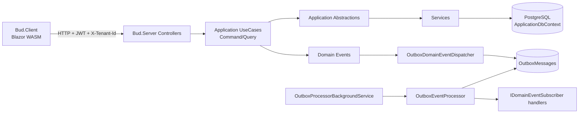
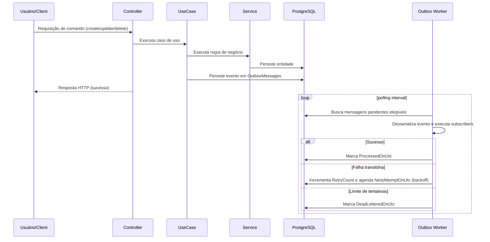

# Bud

Aplicação unificada em ASP.NET Core + Blazor WebAssembly (SPA),
utilizando PostgreSQL.

## Arquitetura da aplicação

### Visão geral

O Bud segue uma arquitetura em camadas com separação explícita de responsabilidades:

- **API/Host (`Bud.Server`)**: exposição HTTP, autenticação/autorização, middleware e composição de dependências.
- **Application**: casos de uso (`Command/Query`), contratos de entrada/saída e regras de orquestração.
- **Domain**: eventos e conceitos de domínio.
- **Infrastructure**: implementação de capacidades técnicas (Outbox, processamento em background, serialização de eventos).
- **Data**: EF Core (`ApplicationDbContext`), mapeamentos e migrations.
- **Client (`Bud.Client`)**: SPA Blazor WASM com consumo da API.
- **Shared (`Bud.Shared`)**: contratos e modelos compartilhados entre cliente e servidor.

### Organização do backend (Bud.Server)

- **Controllers** recebem requests, validam payloads (FluentValidation) e delegam para UseCases.
- **UseCases** centralizam o fluxo da aplicação e retornam `ServiceResult`/`ServiceResult<T>`.
- **Abstractions (`Application/Abstractions`)** definem portas usadas pelos UseCases.
- **Services** implementam essas portas com regras de negócio e acesso a dados.
- **DependencyInjection** modulariza bootstrap (`BudApi`, `BudSecurity`, `BudData`, `BudApplication`).

### Multi-tenancy

Isolamento por organização (`OrganizationId`) com:

- `ITenantProvider` para resolver tenant do contexto autenticado.
- Query filters globais do EF Core.
- `TenantRequiredMiddleware` para reforçar seleção/autorização de tenant em `/api/*`.
- Cabeçalho `X-Tenant-Id` enviado pelo client quando uma organização específica está selecionada.

### Fluxo de requisição (resumo)

1. Request chega no controller.
2. Payload é validado.
3. Controller chama o UseCase correspondente.
4. UseCase aplica regras de autorização/orquestração e delega para portas/serviços.
5. Serviço persiste/consulta via `ApplicationDbContext`.
6. Resultado (`ServiceResult`) é mapeado para resposta HTTP.

### Outbox e processamento assíncrono

Visão geral no fluxo arquitetural. Para detalhes operacionais (endpoints e configuração),
veja a seção **Outbox (resiliência de eventos)** abaixo.

### Testes e governança arquitetural

- **Unit tests**: regras de negócio, validações, use cases e componentes de infraestrutura.
- **Integration tests**: ciclo HTTP completo com PostgreSQL em container.
- **Architecture tests**: evitam regressão de fronteira entre camadas (ex.: controller depender de service legado).
- **ADRs**: decisões arquiteturais versionadas em `docs/adr/`.

### ADRs e fluxo de PR

- Toda mudança arquitetural deve criar/atualizar ADR.
- ADRs seguem convenção `docs/adr/ADR-XXXX-*.md`.
- Índice e convenções: `docs/adr/README.md`.
- No PR, inclua explicitamente:
  - `Architectural impact: yes/no`
  - `ADR: ADR-XXXX` (quando aplicável)

ADRs base atuais:

- `docs/adr/ADR-0006-stack-tecnologica.md`
- `docs/adr/ADR-0001-usecases-abstractions-services.md`
- `docs/adr/ADR-0007-estilo-api-problemdetails.md`
- `docs/adr/ADR-0008-autenticacao-autorizacao.md`
- `docs/adr/ADR-0009-persistencia-efcore-migrations.md`
- `docs/adr/ADR-0002-multitenancy-organizationid.md`
- `docs/adr/ADR-0010-openapi-semantica.md`
- `docs/adr/ADR-0003-outbox-retry-deadletter.md`
- `docs/adr/ADR-0004-governanca-testes-arquitetura.md`
- `docs/adr/ADR-0005-estrategia-testes.md`

### Diagramas

#### Arquitetura e fluxo principal



#### Sequência de processamento do Outbox



## Como rodar com Docker

```bash
docker compose up --build
```

- App (UI + API): `http://localhost:8080`
- Swagger (ambiente Development): `http://localhost:8080/swagger`

### Padrão de desenvolvimento (sem hot reload)

- O hot reload do Blazor WASM está desativado por padrão.
- O build usa caches de NuGet e de compilação via volumes nomeados para acelerar o ciclo local.

Se você encontrar assets antigos no browser, limpe os volumes e recompile:

```bash
docker compose down -v
docker compose up --build
```

## Design System & Tokens

Bud 2.0 uses a comprehensive design token system based on the [Figma Style Guide](https://www.figma.com/design/j3n8YHBusCH8KEHvheGeF8/-ASSETS--Style-Guide).

### Brand Colors

- **Primary**: Orange (#FF6B35) - CTAs, active states, primary actions
- **Secondary**: Wine (#E838A3) - Accents, highlights, secondary actions

### Typography

- **Crimson Pro**: Serif font for headings and display text
- **Plus Jakarta Sans**: Sans-serif for body text and UI components

### Design Tokens

All design values (colors, typography, spacing, shadows) are defined as CSS custom properties in [`src/Bud.Client/wwwroot/css/tokens.css`](src/Bud.Client/wwwroot/css/tokens.css).

**Usage example:**
```css
.button {
    background: var(--color-brand-primary);
    padding: var(--spacing-3) var(--spacing-4);
    border-radius: var(--radius-md);
    font-size: var(--font-size-base);
}
```

### Updating Design Tokens

See [DESIGN_TOKENS.md](DESIGN_TOKENS.md) for:
- Complete token reference
- How to update tokens from Figma
- Token naming conventions
- Best practices

## Migrations (EF Core)

Já existe a migration inicial (`InitialCreate`). Para aplicar no banco com Docker rodando:

```bash
docker run --rm -v "$(pwd)/src":/src -w /src/Bud.Server --network bud_default \
  -e ConnectionStrings__DefaultConnection="Host=db;Port=5432;Database=bud;Username=postgres;Password=postgres" \
  mcr.microsoft.com/dotnet/sdk:10.0 \
  bash -lc "dotnet tool install --tool-path /tmp/tools dotnet-ef --version 10.0.2 && /tmp/tools/dotnet-ef database update"
```

No ambiente Development, a API tenta aplicar migrations automaticamente no startup.

## Outbox (resiliência de eventos)

O projeto usa Outbox para garantir processamento assíncrono confiável de eventos de domínio.

- Persistência transacional de eventos em `OutboxMessages`
- Worker em background para processamento
- Retry com backoff exponencial
- Dead-letter após esgotar tentativas
- Endpoints administrativos para consulta e reprocessamento

### Endpoints de Outbox (admin)

- GET `/api/outbox/dead-letters?page=1&pageSize=10`
- POST `/api/outbox/dead-letters/{id}/reprocess`
- POST `/api/outbox/dead-letters/reprocess`

### Configuração (`appsettings`)

Tudo fica sob a chave `Outbox`:

```json
"Outbox": {
  "HealthCheck": {
    "MaxDeadLetters": 0,
    "MaxOldestPendingAge": "00:15:00"
  },
  "Processing": {
    "MaxRetries": 5,
    "BaseRetryDelay": "00:00:05",
    "MaxRetryDelay": "00:05:00",
    "BatchSize": 100,
    "PollingInterval": "00:00:05"
  }
}
```

O endpoint `/health/ready` considera banco e saúde do Outbox.

## Endpoints básicos (criação)

- POST `/api/organizations`
- POST `/api/workspaces`
- POST `/api/teams`
- POST `/api/collaborators`

## Endpoints básicos (listagens)

- GET `/api/organizations?search=&page=1&pageSize=10`
- GET `/api/workspaces?organizationId=&search=&page=1&pageSize=10`
- GET `/api/teams?workspaceId=&parentTeamId=&search=&page=1&pageSize=10`
- GET `/api/collaborators?teamId=&search=&page=1&pageSize=10`

### Relacionamentos

- GET `/api/organizations/{id}/workspaces`
- GET `/api/workspaces/{id}/teams`
- GET `/api/teams/{id}/subteams`
- GET `/api/teams/{id}/collaborators`

### Exemplo de payloads

```json
{
  "name": "Acme"
}
```

```json
{
  "name": "Produto",
  "organizationId": "00000000-0000-0000-0000-000000000000"
}
```

```json
{
  "name": "Time A",
  "workspaceId": "00000000-0000-0000-0000-000000000000",
  "parentTeamId": null
}
```

```json
{
  "fullName": "Maria Silva",
  "email": "maria@acme.com",
  "teamId": "00000000-0000-0000-0000-000000000000"
}
```
